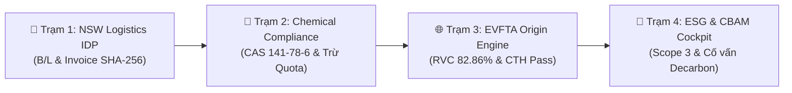

# INSILOS ENTERPRISE SUITE: NỀN TẢNG QUẢN TRỊ NGOẠI THƯƠNG, HÓA CHẤT & BÁO CÁO ESG THẾ HỆ MỚI

> **Tài liệu Giới thiệu Sản phẩm & Giải pháp Chuyên sâu**  
> *Phiên bản:* Enterprise v20.0-PROD | *Nền tảng:* Odoo 20 LTS Hardfork Architecture  
> *Đơn vị phát triển:* Insilos Enterprise Solutions Group  

---

## 1. Giới Thiệu Tổng Quan & Tầm Nhìn
Trong bối cảnh chuỗi cung ứng toàn cầu đối mặt với các rào cản kỹ thuật khắt khe như **Luật Hóa chất 69/2025/QH15**, **Nghị định 113/2017/NĐ-CP**, **Cơ chế Điều chỉnh Biên giới Carbon của EU (CBAM)** và các quy tắc xuất xứ phức tạp trong các hiệp định thương mại tự do thế hệ mới (**EVFTA, CPTPP, RCEP**), các doanh nghiệp xuất nhập khẩu và sản xuất cần một giải pháp ERP chuyên biệt, tích hợp liền mạch giữa vận hành và tuân thủ pháp lý.

**Insilos Enterprise Suite** là hệ sinh thái ERP tiên phong giải quyết toàn diện bài toán này bằng công nghệ tự động hóa xử lý chứng từ (**Logistics IDP**), sổ cái hạn ngạch giấy phép hóa chất thời gian thực, thuật toán thẩm định xuất xứ FTA tự động và bảng điều khiển đo lường phát thải carbon chuẩn quốc tế **GLEC**.

---

## 2. Bốn Trụ Cột Giá Trị Cốt Lõi (Core Value Pillars)

### 📑 1. Logistics IDP & Bằng Chứng Bất Biến (Immutable Audit Trail)
- **Bóc tách dữ liệu thông minh:** Tự động nhận diện và bóc tách chứng từ hải quan số một cửa (NSW), vận đơn đường biển (B/L), hóa đơn thương mại (Commercial Invoice).
- **Đối soát 3 chiều (3-Way Reconciliation):** Khớp nối tự động giữa Đơn mua hàng (PO), Hóa đơn nhà cung cấp và Tờ khai hải quan điện tử.
- **Bảo mật mật mã học:** Đóng dấu băm **SHA-256** cho từng bằng chứng nghiệp vụ (`logistics.idp.evidence`), chống chối bỏ và sẵn sàng kiểm toán hải quan 100%.

### 🧪 2. Tuân Thủ Hóa Chất XNK & Quản Trị Hạn Ngạch
- **Bản đồ hóa chất toàn diện:** Tra cứu tức thì số CAS, mã UN, công thức phân tử và danh mục quản lý (hóa chất kinh doanh có điều kiện, hạn chế, tiền chất).
- **Sổ cái Hạn ngạch Giấy phép (Permit Quota Ledger):** Liên kết trực tiếp giấy phép của Bộ Công Thương với từng tờ khai nhập khẩu, tự động trừ quota thời gian thực với cơ chế Capability Tokens bảo mật cao.

### 🌐 3. Công Cụ Quyết Định Xuất Xứ Ưu Đãi FTA (Form EUR.1, Form D, Form E)
- **Tính toán hàm lượng RVC tự động:** Áp dụng công thức gián tiếp và trực tiếp dựa trên BOM và giá trị Ex-Works (FOB).
- **Kiểm định chuyển đổi nhóm (CTH/CTC):** Tự động phát hiện chuyển đổi mã HS nguyên liệu sang thành phẩm (ví dụ: Chương 29 sang Chương 32).
- **Bảo vệ biên lợi nhuận:** Đảm bảo doanh nghiệp thụ hưởng đầy đủ mức thuế nhập khẩu ưu đãi 0%.

### 🌱 4. Báo Cáo Phát Thải ESG (Scope 3 Logistics) & Cố Vấn CBAM EU
- **Đo lường phát thải logistics chuẩn GLEC:** Tính toán dấu chân carbon vận tải biển, đường bộ, hàng không dựa trên tấn-km (t-km) và hải trình thực tế.
- **Tín chỉ Paperless IDP:** Ghi nhận bù trừ phát thải trực tiếp từ việc số hóa không dùng giấy tờ.
- **Tư vấn tối ưu phí chứng chỉ CBAM:** Dự phóng chi phí thuế biên giới carbon của EU (€/tCO2e) và mô phỏng giải pháp năng lượng tái tạo (DPPA, Solar Rooftop) tiết kiệm hàng ngàn Euro mỗi năm.

---

## 3. Câu Chuyện Nghiệp Vụ Thực Tế: Chuỗi Giá Trị Liên Module (E2E Workflow)

Dưới đây là luồng thực thi thực tế đã được kiểm định và xác thực trên cơ sở dữ liệu `odoo20_dev`:

1. **Trạm 1 (IDP):** Nhận diện lô hàng nhập khẩu Ethyl Acetate từ Singapore Petrochemicals Corp (`ONE-SIN-SGN-4412`), tạo hồ sơ `IDP-CASE-20260924094742`, đóng dấu hash SHA-256 `82ce79cea9b2cf0...`.
2. **Trạm 2 (Hóa chất):** Hệ thống nhận diện chất CAS 141-78-6 thuộc diện quản lý điều kiện, đối chiếu Giấy phép GP-BCT-2026-EA-019 (Quota 100,000 kg), tự động trừ 20,000 kg &rarr; Số dư khả dụng cập nhật còn 80,000 kg (80%).
3. **Trạm 3 (Xuất xứ FTA):** Sau khi phối trộn sản xuất ra thành phẩm Sơn phủ công nghiệp (HS 3208.20, giá trị $175,000), hệ thống tính RVC đạt 82.86% (&ge; 50%) và thỏa mãn CTH (Chương 29 &rarr; Chương 32), tự động đủ điều kiện cấp Form EUR.1 thuế 0% sang thị trường EU.
4. **Trạm 4 (ESG & CBAM):** Ghi nhận phát thải logistics tuyến Singapore - Cát Lái (2,185 km, 20 tấn) là 545.97 kg CO2e; Cố vấn CBAM phân tích cường độ phát thải 0.38 tCO2e/t và đề xuất lộ trình tăng tỷ lệ điện mặt trời để tiết kiệm €1,462/năm.

---

## 4. Thước Đo Hiệu Quả Nghiệp Vụ (ROI & Business Metrics)

| Chỉ Số Đánh Giá | Quy Trình Thủ Công Trước Đây | Với Insilos Enterprise Suite | Hiệu Quả Đạt Được |
|---|---|---|---|
| **Thời gian xử lý 1 bộ chứng từ NSW** | 4 – 8 giờ làm việc | Dưới 3 phút | **Nhanh hơn 95%** |
| **Rủi ro vi phạm Quota Hóa chất** | 5 – 10% do sai lệch sổ sách | 0% (Khấu trừ tự động thời gian thực) | **Loại trừ 100% rủi ro phạt** |
| **Tận dụng ưu đãi thuế quan FTA** | Dễ bỏ sót do quy tắc phức tạp | Tự động phân tích và cấp chứng thư | **Hưởng trọn thuế 0%** |
| **Báo cáo phát thải Scope 3 & CBAM** | Mất vài tuần thuê tư vấn ngoài | Tự động kết xuất báo cáo chuẩn GLEC | **Tiết kiệm hàng chục ngàn USD** |

---

## 5. Thư Viện Ảnh Giao Diện Thực Tế (Screenshots)

- **Màn hình Khởi chạy Ứng dụng:** `doc/screenshots/01_insilos_launcher_apps.png`
- **Tháp điều khiển Logistics IDP:** `doc/screenshots/02_logistics_idp_control_tower.png`
- **Chi tiết Hồ sơ IDP & SHA-256 Evidence:** `doc/screenshots/03_logistics_idp_case_detail.png`
- **Hồ sơ Tuân thủ Hóa chất Một cửa (NSW):** `doc/screenshots/04_chemical_compliance_dossier.png`
- **Sổ cái Quản trị Hạn ngạch Giấy phép BCT:** `doc/screenshots/05_chemical_quota_ledger.png`
- **Báo cáo Phát thải Scope 3 Freight Carbon:** `doc/screenshots/07_esg_freight_carbon.png`
- **Bảng Cố vấn Thuế Carbon CBAM:** `doc/screenshots/07_esg_cbam_advisor.png`
- **Terminal Dữ liệu Thị trường (TradingView):** `doc/screenshots/08_market_terminal_tradingview.png`

---

## 6. Liên Hệ & Hợp Tác Triển Khai
- **Trang chủ:** https://insilos.com
- **Email:** enterprise@insilos.com
- **Đường dây nóng hỗ trợ:** +84 (0) 28 8888 6666
- **Địa chỉ:** Tòa nhà Insilos Innovation Hub, TP. Hồ Chí Minh, Việt Nam
