# SOVEREIGN SEQUENTIAL PDCA AST-GREP REFACTORING SPECIFICATION
## "No-Forbidden-Zone" Architecture: OWL 3 → QWeb → ORM Models → PostgreSQL Table Names

**Document Version**: 1.0.0-ENTERPRISE  
**Classification**: Insilos Hard Fork Core Engineering Framework  
**Date**: October 4, 2026  
**Status**: APPROVED SPECIFICATION & EXECUTION BLUEPRINT  

---

## 1. Executive Summary & Paradigm Shift

### 1.1 The Context & The Historic Restriction
In previous refactoring phases, the Insilos Platform adopted a protective boundary termed **"Strict Database Schema Invariance"**. Under this boundary, table names, raw SQL schemas, and deep framework class symbols were isolated from structural alterations, relying instead on runtime adapters, WSGI middleware, and SCSS styling overrides. While this prevented runtime regression, it left persistent internal footprints ("genesis legacy signatures") buried within:
- **OWL 3 Components**: Hard-coded service names, legacy `.o_*` DOM class hooks, and component registries.
- **QWeb Architecture**: Deprecated XML view models, obsolete template identifiers, and legacy XML IDs.
- **Python ORM Core**: Model namespaces (`_name`), relational field declarations, and method hooks.
- **PostgreSQL Database**: Physical table names (e.g., `res_partner`, `mail_message`, `ir_attachment`).

### 1.2 The Sovereign "No-Forbidden-Zone" Breakthrough
This specification documents and institutionalizes the battle-tested methodology:
> **"Sequential PDCA AST-Grep Refactoring with No Forbidden Zones"**  
> *(Tuần tự PDCA AST Grep để khoanh vùng và sửa chữa các Odoo code footprint mà không có vùng cấm, xuyên suốt từ OWL 3, QWeb, Python ORM đến PostgreSQL Table Names).*

By replacing brittle, context-blind regex/sed patterns with **Concrete Syntax Tree (CST) and Abstract Syntax Tree (AST) pattern rewriting (`ast-grep` / `sg`)**, combined with a **Topologically Ordered, Bounded-Cohort PDCA Loop**, we achieve complete structural platform sovereignty without breaking backward compatibility or runtime stability.

```
┌──────────────────────────────────────────────────────────────────────────────────┐
│                   SOVEREIGN "NO FORBIDDEN ZONE" SPECTRUM                         │
└──────────────────────────────────────────────────────────────────────────────────┘
   [Layer 1: OWL 3]    ──▶  [Layer 2: QWeb]     ──▶  [Layer 3: ORM]     ──▶  [Layer 4: DDL]
   Component Classes       XML Views & Arch         _name & Fields          Table Names
   Registries & Hooks      XPath Expressions        Method Signatures       Foreign Keys
   DOM Class Signatures    Templates & XML IDs      SQL Query Bindings      PostgreSQL Views
```

---

## 2. The 4-Layer Architecture (Scope & AST Mapping)

### Layer 1: Frontend OWL 3 Engine (`addons/web/static/src/`, `enterprise/*/static/src/`)
- **Target Footprints**:
  1. Component definitions: `class $NAME extends Component`
  2. OWL Registries: `registry.category("services").add("$KEY", $VAL)`
  3. OWL Hooks: `useService("$NAME")`, `useSubEnv(...)`
  4. DOM Class Hooks: Legacy `.o_*` class dependencies in JS event delegates and selectors.
- **AST-Grep Polyglot Rules**:
  ```yaml
  # tools/ast_grep/rules/owl3/owl_service_rename.yml
  id: insilos-owl-service-registry
  language: javascript
  rule:
    pattern: registry.category("services").add("$OLD_KEY", $HANDLER)
  fix: registry.category("services").add("$NEW_KEY", $HANDLER)
  ```

### Layer 2: QWeb Semantic Architecture (`views/*.xml`, `data/*.xml`)
- **Target Footprints**:
  1. Record Model references: `<record id="..." model="ir.ui.view"><field name="model">$LEGACY_MODEL</field>`
  2. XPath Target Selectors: `<xpath expr="//field[@name='$LEGACY_FIELD']" ...>`
  3. QWeb Templates: `<t t-name="$LEGACY_TEMPLATE">`, `<t t-call="$LEGACY_TEMPLATE">`
  4. Menu & Action Bindings: `<menuitem id="..." action="$ACTION_ID" model="$MODEL"/>`
- **AST / LXML Transformation Rule**:
  Because standard HTML parsers can drop XML namespaces or processing instructions, QWeb views are parsed through an AST-aware LXML / Tree-sitter pipeline that preserves comments, CDATA, indentation, and element ordering.

### Layer 3: Python ORM Models & Fields Engine (`odoo/orm/`, `addons/*/models/`)
- **Target Footprints**:
  1. Model Names: `_name = '$OLD_MODEL'` $\rightarrow$ `_name = '$NEW_MODEL'`
  2. Model Table Mapping: `_table = '$OLD_TABLE'` $\rightarrow$ `_table = '$NEW_TABLE'`
  3. Inheritance Chains: `_inherit = '$OLD_MODEL'`
  4. Relational Fields: `fields.Many2one('$OLD_MODEL', ...)`
  5. Method Decorators: `@api.depends('$FIELD_PATH')`, `@api.model`
- **AST-Grep Python Rules**:
  ```yaml
  # tools/ast_grep/rules/orm/orm_model_rename.yml
  id: insilos-orm-model-name
  language: python
  rule:
    pattern: _name = '$OLD_NAME'
  fix: _name = '$NEW_NAME'
  ```
  ```yaml
  # tools/ast_grep/rules/orm/orm_field_relation.yml
  id: insilos-orm-relation-field
  language: python
  rule:
    pattern: fields.Many2one('$OLD_NAME', $$$ARGS)
  fix: fields.Many2one('$NEW_NAME', $$$ARGS)
  ```

### Layer 4: PostgreSQL Physical Database Schema & Table Names
- **The Core Invariant**: Raw SQL queries, third-party addons, and active reporting pipelines must never crash with `relation does not exist`.
- **The 4-Phase Zero-Breakage Database Migration Pattern**:
  1. **Phase A (Physical DDL Rename)**:
     ```sql
     ALTER TABLE res_partner RENAME TO insilos_partner;
     ALTER SEQUENCE res_partner_id_seq RENAME TO insilos_partner_id_seq;
     ```
  2. **Phase B (Updatable Compatibility View Facade)**:
     ```sql
     -- PostgreSQL 9.3+ automatically treats single-table views as directly updatable!
     -- INSERT, UPDATE, and DELETE on 'res_partner' transparently operate on 'insilos_partner'.
     CREATE OR REPLACE VIEW res_partner AS 
       SELECT * FROM insilos_partner;
     ```
  3. **Phase C (Trigger / Constraint Parity Verification)**:
     ```sql
     -- If rules or INSTEAD OF triggers are required for complex composite views:
     CREATE OR REPLACE RULE res_partner_insert AS 
       ON INSERT TO res_partner DO INSTEAD 
       INSERT INTO insilos_partner VALUES (NEW.*);
     ```
  4. **Phase D (ORM Synchronous Binding)**:
     The Python ORM model points `_table = 'insilos_partner'`, while the dynamic registry aliases `res_partner` to the same model structure.

---

## 3. The Sequential PDCA Workflow Engine

Refactoring without forbidden zones must proceed **sequentially by bounded cohort** (never a global shotgun rewrite). Each cohort represents an isolated domain cluster (e.g., Master Data `res.partner`, Messaging `mail.message`, Attachments `ir.attachment`, Catalog `product.template`).

```mermaid
flowchart TD
    subgraph PDCA_CYCLE ["Bounded Cohort Sequential PDCA Loop"]
        P1["Plan: AST Footprint Audit & Dependency Graph"] --> P2["Plan: Snapshot Checkpoint & DB Savepoint"]
        P2 --> D1["Do: PostgreSQL DDL Migration & Updatable View"]
        D1 --> D2["Do: AST-Grep Python ORM Structural Rewrite"]
        D2 --> D3["Do: QWeb XML View & XPath Realignment"]
        D3 --> D4["Do: OWL 3 Component & Registry Rewrite"]
        D4 --> C1["Check: AST Syntax & Pre-flight Server Boot"]
        C1 --> C2["Check: Targeted HOOT Test Suite"]
        C2 --> C3["Check: CEW Council Gates 8 & 10"]
        C3 --> C4["Check: Database Updatable View Parity"]
        C4 -->|Pass| A1["Act: Atomic Git Commit & Update Ledger"]
        C4 -->|Fail| A2["Act: Auto Rollback & AST Node Isolation"]
        A2 --> P1
        A1 --> NEXT["Proceed to Next Bounded Cohort"]
    end
```



### 3.1 Phase P: Plan
1. **Footprint Extraction**:
   Run `ast-grep scan` using targeted search patterns for the cohort's symbols across Python, JS, XML, and SQL.
2. **Dependency Graph Calculation**:
   Map all incoming foreign keys, XML view inheritance chains, and JavaScript service dependencies.
3. **Safety Checkpoint**:
   Create a git stash / branch snapshot and a PostgreSQL transaction savepoint (`SAVEPOINT cohort_pre_migration`).

### 3.2 Phase D: Do (Topological Order of Execution)
1. **Database Tier**: Execute DDL Table Rename and establish the PostgreSQL Updatable Compatibility View.
2. **Python ORM Tier**: Apply `ast-grep` rewrites on `_name`, `_table`, `_inherit`, and relational fields.
3. **QWeb Tier**: Rewrite `<field name="model">`, `t-name`, `t-inherit`, and XPath selector expressions.
4. **OWL 3 Tier**: Rewrite component imports, service bindings, and template references.

### 3.3 Phase C: Check (Multi-Tier Automated Verification)
1. **Compilation Check**: AST syntax verification across all modified files (`python -m py_compile`, ESLint/Babel AST).
2. **Server Boot Check**: Execute `.venv/bin/python insilos-bin -c insilos.conf -d odoo20_dev --stop-after-init` (exit code 0 required).
3. **Frontend OWL Verification**: Execute the targeted HOOT test cohort (e.g. `node run_hoot.js <cohort>`).
4. **Leak Sweep**: Execute CEW Council Gate 10 (`node tools/sweep_ui_all_apps.js`) to guarantee 0 brand leaks.
5. **Database Parity Check**: Execute automated SQL probe asserting `SELECT count(*) FROM legacy_view` equals `SELECT count(*) FROM sovereign_table`.

### 3.4 Phase A: Act
1. **Success**: Record an atomic git commit with conventional commit tag: `refactor(cohort): ast-grep sovereign migration for <domain>`.
2. **Failure**: Trigger automated instant rollback:
   - `git checkout -- .`
   - `ROLLBACK TO SAVEPOINT cohort_pre_migration;`
   - Output AST error report pointing to the exact offending node and line number for human-in-the-loop / Fleet agent refinement.

---

## 4. AST-Grep Directory & Tooling Architecture

To make this methodology fully repeatable and automated, the repository structure is configured as follows:

```
/home/zen/O20/
├── tools/
│   └── ast_grep/
│       ├── sgconfig.yml               # Central ast-grep project configuration
│       ├── rules/
│       │   ├── owl3/                  # JavaScript OWL 3 rules
│       │   │   ├── owl_service.yml
│       │   │   ├── owl_component.yml
│       │   │   └── owl_css_class.yml
│       │   ├── qweb/                  # QWeb XML & Arch rules
│       │   │   ├── qweb_model.yml
│       │   │   └── qweb_xpath.yml
│       │   └── orm/                   # Python ORM model & field rules
│       │       ├── orm_model_name.yml
│       │       ├── orm_table_name.yml
│       │       └── orm_relation.yml
│       ├── engine/
│       │   ├── pdca_runner.py         # Autonomous sequential PDCA orchestrator
│       │   ├── db_migrator.py         # Table rename & updatable view generator
│       │   └── dependency_tracer.py   # Cross-layer symbol reference resolver
│       └── cohorts/
│           ├── 01_master_data.json    # Cohort 1: res.partner, res.company, res.users
│           ├── 02_attachment_docs.json# Cohort 2: ir.attachment, ir.model.data
│           └── 03_messaging_chat.json # Cohort 3: mail.message, mail.channel
```

---

## 5. Phased Cohort Execution Roadmap

| Cohort | Domain Scope | Primary Table & Model Mutations | Validation Suites |
| :--- | :--- | :--- | :--- |
| **Cohort 1** | **System & Documents** | `ir_attachment` $\rightarrow$ `insilos_attachment`<br>`ir_model_data` $\rightarrow$ `insilos_model_data` | Server boot, HOOT `web_map`, Gate 8 |
| **Cohort 2** | **Master Data: Business Partner** | `res_partner` $\rightarrow$ `insilos_partner` (BP)<br>`res_partner_category` $\rightarrow$ `insilos_partner_category` | HOOT `web_cohort`, CEW Gates 8 & 10, Form View audit |
| **Cohort 3** | **Materials Management (MM)** | `product_template` $\rightarrow$ `insilos_product_template`<br>`product_product` $\rightarrow$ `insilos_product_product` | HOOT `web_grid`, Inventory Playwright suite |
| **Cohort 4** | **Communication & Telegram Discuss** | `mail_message` $\rightarrow$ `insilos_message`<br>`discuss_channel` $\rightarrow$ `insilos_chat_channel` | Discuss Composer Playwright test, HOOT discuss |
| **Cohort 5** | **Sales & Distribution (SD)** | `sale_order` $\rightarrow$ `insilos_sale_order`<br>`sale_order_line` $\rightarrow$ `insilos_sale_order_line` | ERP Live E2E workflow, B2B Seed Data test |

---

## 6. Acceptance & Compliance Invariants

1. **Zero Runtime Syntax Breakage**: Every AST rewrite must preserve token spacing, comment blocks, and docstrings.
2. **Zero Missing Relation Errors**: Every physical PostgreSQL table rename MUST be accompanied by an Updatable PostgreSQL View with the legacy name.
3. **100% Quality Gate Gating**: No cohort is committed until:
   - Server boots with exit code 0 (`insilos-bin -c insilos.conf -d odoo20_dev --stop-after-init`).
   - Relevant HOOT test cohorts pass with 0 failures.
   - CEW Council Gates 8 & 10 pass with 0 brand leaks.
4. **Idempotence & Reversibility**: Any cohort migration must be fully reversible within 500ms via rollback savepoint.
